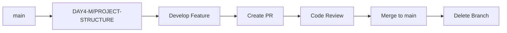

# Branch Naming Conventions

This document outlines the team's branching strategy for SprintLite development.

## Branch Structure Pattern

We follow a **DAY-MEMBER/TASK** naming convention to track daily work assignments:

```
DAY<number>-<INITIAL>/<TASK-NAME>
```

### Components:
- **DAY<number>**: Sprint day identifier (DAY1, DAY2, DAY3, etc.)
- **<INITIAL>**: Team member identifier
  - `M` - MOHIT
  - `S` - SAM  
  - `V` - VIJAY
- **<TASK-NAME>**: Brief description of the task in UPPERCASE

## Examples from Our Project

### Development Branches
```
DAY1-M/ENV              - MOHIT working on environment setup (Day 1)
DAY2-S/HLD              - SAM working on High-Level Design (Day 2)
DAY3-V/LLD              - VIJAY working on Low-Level Design (Day 3)
DAY4-M/PROJECT-STRUCTURE - MOHIT building project structure (Day 4)
DAY4-S/TS-ES            - SAM setting up TypeScript/ESLint (Day 4)
DAY4-V/ENV-VAR          - VIJAY implementing environment variables (Day 4)
```

### Main Branches
- **`main`**: Production-ready code, protected with PR reviews
- **`Fast-Track`**: Quick integration branch for urgent fixes

## Why This Convention?

✅ **Traceability**: Easy to see who worked on what and when  
✅ **Daily Progress Tracking**: Clear mapping to sprint days  
✅ **Team Coordination**: Prevents naming conflicts between team members  
✅ **Task Organization**: Self-documenting branch names  
✅ **Academic Context**: Aligns with daily assignment structure  

## Alternative Conventions (For Reference)

For traditional projects, consider:

### Feature Development
```
feature/login-auth
feature/task-kanban-board
feature/user-settings-page
```

### Bug Fixes
```
fix/navbar-alignment
fix/database-connection-timeout
fix/eslint-errors
```

### Chores & Maintenance
```
chore/update-dependencies
chore/cleanup-unused-imports
chore/optimize-docker-build
```

### Documentation
```
docs/update-readme
docs/api-documentation
docs/deployment-guide
```

### Hotfixes (Production Issues)
```
hotfix/security-vulnerability
hotfix/critical-login-bug
```

## Branch Lifecycle



## Creating a New Branch

```bash
# From main branch
git checkout main
git pull origin main

# Create your feature branch (follow naming convention)
git checkout -b DAY5-M/AUTHENTICATION-LOGIC

# Work on your changes...
git add .
git commit -m "feat: implement JWT authentication"

# Push to remote
git push origin DAY5-M/AUTHENTICATION-LOGIC
```

## Best Practices

✅ **DO:**
- Keep branch names concise but descriptive
- Use hyphens to separate words (not underscores or spaces)
- Follow team convention consistently
- Delete branches after merging
- Create PR as soon as branch is pushed (even if WIP)

❌ **DON'T:**
- Use spaces in branch names
- Create generic names like `test`, `temp`, `fix`
- Work directly on `main` branch
- Keep branches alive for more than 2-3 days
- Include issue numbers without context (use descriptive names)

## Switching Between Branches

```bash
# Check current branch
git branch

# Switch to existing branch
git checkout DAY4-V/ENV-VAR

# Create and switch to new branch
git checkout -b DAY5-S/REDIS-CACHE

# List all branches (local and remote)
git branch -a
```

## When to Create a New Branch

- Starting a new task or user story
- Fixing a bug that requires multiple commits
- Experimenting with a new approach
- Updating documentation that needs review
- Adding a new feature or component

## When to Merge and Delete

- ✅ All tests passing
- ✅ Code reviewed and approved
- ✅ PR checks passed (lint, type check, build)
- ✅ Conflicts resolved
- ✅ Documentation updated

After merge:
```bash
# Delete local branch
git branch -d DAY4-M/PROJECT-STRUCTURE

# Delete remote branch (if not auto-deleted by GitHub)
git push origin --delete DAY4-M/PROJECT-STRUCTURE
```

## Team Member Initials Reference

| Initial | Name | Typical Responsibilities |
|---------|------|--------------------------|
| M | MOHIT | Architecture, Environment, CI/CD, Full-stack |
| S | SAM | Design, TypeScript, Code Quality, Frontend |
| V | VIJAY | Database, Security, Configuration, Backend |

---

**Note**: This convention works for our academic sprint-based project. For larger teams or longer projects, consider adopting industry-standard conventions like GitFlow or GitHub Flow.
